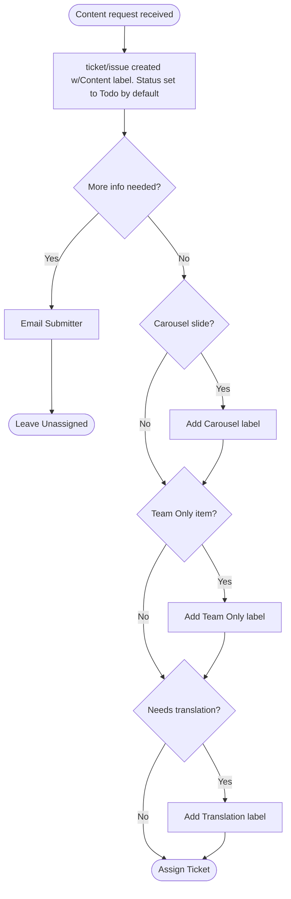

```mermaid
flowchart TD
    %% Start & Column 0
    start([Content request received]) --> ticket[ticket/issue created w/Content label. Status set to Todo by default]

    %% Main Path down the Decisions
    ticket --> eval{More info needed?}
    eval -- No --> cq{Carousel slide?}
    cq -- No --> toq{Team Only item?}
    toq -- No --> tq{Needs translation?}
    tq -- No --> assign([Assign Ticket])

    %% Side-Exit Actions for YES responses
    eval -- Yes --> email[Email Submitter] --> unassigned([Leave Unassigned])
    cq -- Yes --> slide[Add Carousel label]
    toq -- Yes --> team[Add Team Only label]
    tq -- Yes --> translation[Add Translation label]

    %% Re-entry lines routed cleanly back into the main pipeline
    slide --> toq
    team --> tq
    translation --> assign

```
